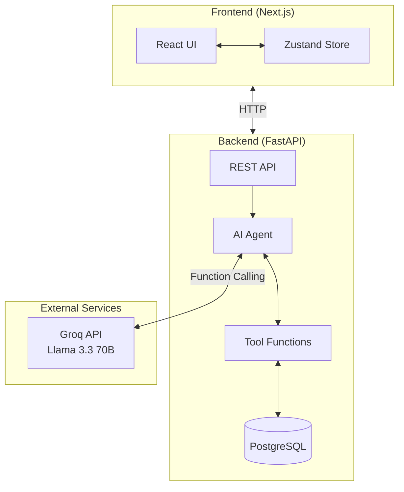
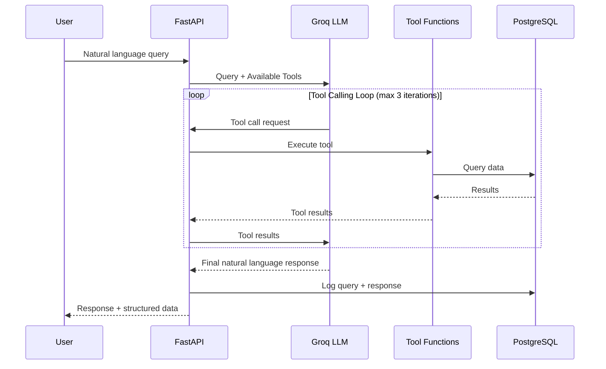
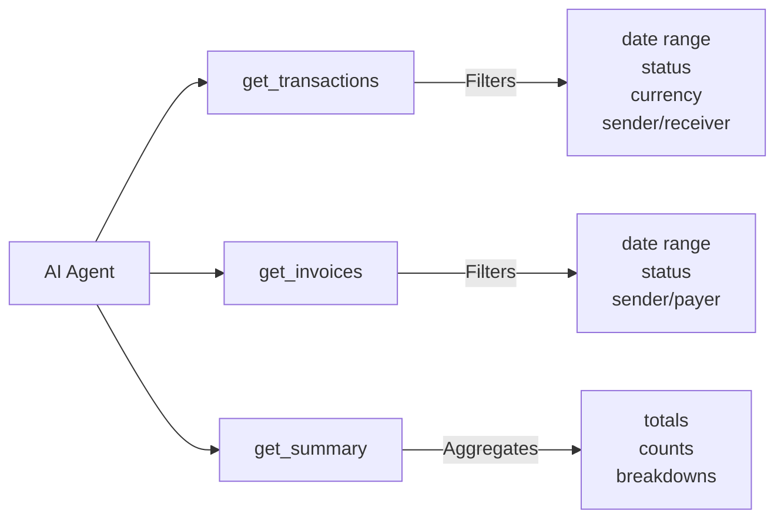
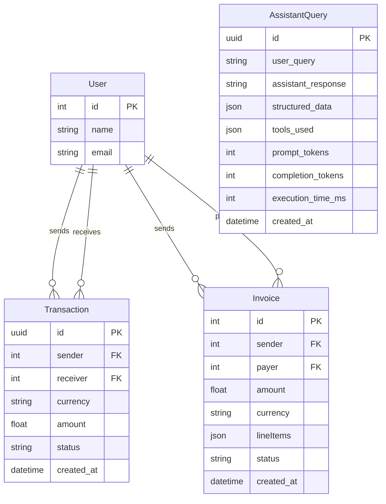
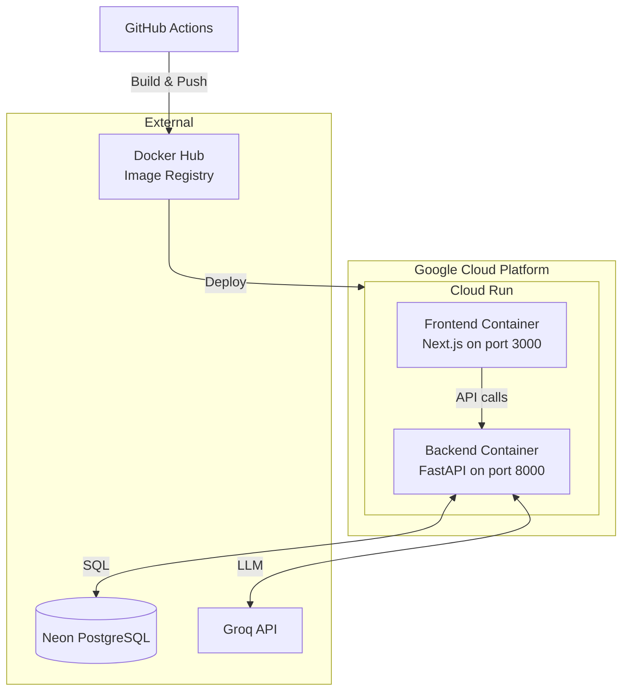

# Solution Architecture

## Overview

OpenTax is an AI-powered financial assistant that allows users to query transactions and invoices using natural language. The system uses an agentic architecture where an LLM (Groq/Llama 3.3) acts as a reasoning engine that decides which tools to call based on user queries.

## System Architecture



## AI Agent Architecture

The AI assistant uses a **ReAct-style agent loop** with function calling. The LLM decides which tools to invoke based on the user's natural language query.



## Available Tools

The agent has access to three tools for querying financial data:



## Data Model



## Key Assumptions

1. **Single-tenant**: No multi-user authentication; all data is accessible to any user
2. **Trusted input**: User queries are passed directly to the LLM without sanitization
3. **Date parsing**: Natural language dates (e.g., "last week") are parsed server-side using `dateparser`
4. **Currency**: No automatic currency conversion; amounts are stored in their original currency
5. **Data generation**: Test data is generated via LLM to simulate realistic financial scenarios

## Major Tradeoffs

| Decision | Tradeoff | Rationale |
|----------|----------|-----------|
| **Groq + Llama 3.3 70B** | Fast inference but smaller context than GPT-4 | Speed is critical for interactive assistant; 70B model is sufficient for function calling |
| **Function calling vs RAG** | Less flexible but more structured | Function calling provides deterministic data access; RAG would require embedding pipeline |
| **PostgreSQL** | Relational vs document store | Structured financial data benefits from relational queries and joins |
| **No caching** | Fresh data on every query | Simplicity over performance; financial data should be real-time |
| **3 tool call limit** | May not complete complex queries | Prevents runaway costs; most queries resolve in 1-2 calls |
| **No streaming** | User waits for full response | Simpler implementation; acceptable latency with Groq |

## AI Integration

### No Mocking Required

The AI components use the **real Groq API** in all environments. We chose not to mock the AI because:

1. **Groq's free tier** provides sufficient quota for development and testing
2. **Fast inference** (~500ms) makes real API calls practical even in tests
3. **Function calling behavior** is difficult to mock accurately
4. **Query logging** captures all AI interactions for debugging

### LLM Configuration

```python
model = "llama-3.3-70b-versatile"
max_tokens = 1000
tool_choice = "auto"  # LLM decides when to call tools
```

### Prompt Engineering

The system prompt instructs the LLM to:
- Pass natural language dates directly to tools (not convert them)
- Use the provided tools to answer financial questions
- Provide clear, concise responses with relevant data

## Deployment Architecture



## Future Improvements

1. **Authentication**: Add user auth to support multi-tenancy
2. **Streaming responses**: Stream LLM output for better UX
3. **Caching**: Cache common queries to reduce API costs
4. **More tools**: Add tools for creating transactions, generating reports
5. **Conversation memory**: Support follow-up questions with context
